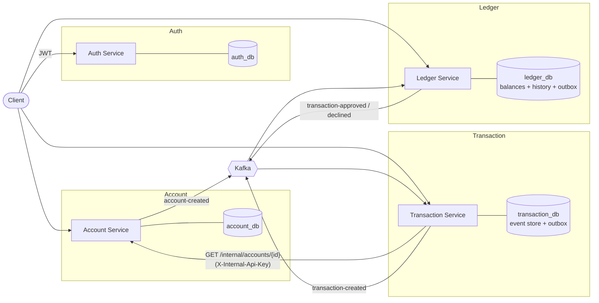
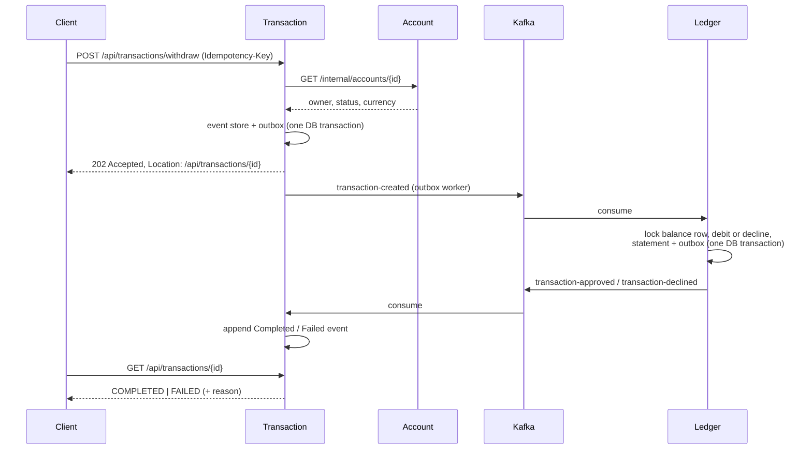

# BankFlow

[](https://github.com/nikola8217/Bankflow/actions/workflows/ci.yml)

A distributed banking backend demonstrating event sourcing, a choreography saga over Kafka and the transactional outbox, designed to stay correct under concurrency and partial failure. Its consistency guarantees are verified by automated tests running against real PostgreSQL and Kafka (Testcontainers).

**Tech stack:** Java 21 · Spring Boot 4 · Apache Kafka · PostgreSQL · Docker Compose · Testcontainers · GitHub Actions

---

## Architecture



| Service | Owns | Responsibility |
|---|---|---|
| **Auth** | users | Registration, login, JWT issuing |
| **Account** | accounts | Opening/closing accounts; publishes `AccountCreated` |
| **Transaction** | transaction lifecycle (event-sourced) | Accepts deposits, withdrawals and transfers; tracks each one to `COMPLETED` or `FAILED` |
| **Ledger** | balances (system of record) | Books money under row locks, decides approve/decline, keeps the account statement |

Each service has its own database; services never read each other's tables.

### Transaction flow

1. The client sends a deposit, withdrawal or transfer to the Transaction service, optionally with an `Idempotency-Key`.
2. The Transaction service checks with the Account service that the source account exists, is active and belongs to the user.
3. In one database transaction it appends `TransactionInitiated` to the event store and writes `TransactionCreated` to the outbox.
4. The client immediately receives **202 Accepted** with `Location: /api/transactions/{id}`.
5. The outbox worker publishes the event to Kafka (`transaction-created`).
6. The Ledger locks the balance row(s), books the money or declines, and in the same database transaction writes the statement entry and a `TransactionApproved` or `TransactionDeclined` event to its outbox.
7. The Transaction service consumes the result and appends `TransactionCompleted` or `TransactionFailed`.
8. The client polls `GET /api/transactions/{id}` and sees `COMPLETED` or `FAILED` with a reason.



Deposits follow the same path: they stay `PENDING` until the Ledger has booked them.

---

## Patterns

**Event sourcing (Transaction).** A transaction's state is never stored directly; it is rebuilt from its events (`Initiated → Completed | Failed`). The status endpoint is served by replaying the aggregate from the event store.

**Ledger as the system of record for balances.** The Ledger is the single writer of balances. It enforces "no overdraft" under a pessimistic lock and is the service that approves or declines.

**CQRS.** Commands and queries take separate paths. Read models: the transaction status (from the event store) and the account statement (a projection in the Ledger).

**CommandBus.** Every write in the Transaction service is a command object dispatched through a small, hand-written `CommandBus` to exactly one handler, discovered through Spring's dependency injection. Controllers stay thin, and adding a new operation means adding a command and a handler without touching existing code.

**Choreography saga.** Transaction and Ledger coordinate only through events; there is no orchestrator. With two participants, an orchestrator would add coupling without adding value.

**Transactional outbox (all three producers).** Domain changes and the outgoing event are committed in the same database transaction; a worker publishes to Kafka and marks the row only after the broker acknowledges it.

**Hexagonal architecture.** Business logic depends on ports (`IEventStore`, `IAccountClient`, `ITransactionRunner`, …); Spring, JPA, Kafka and HTTP live in adapters. This keeps most business tests plain unit tests.

---

## Consistency guarantees

| Guarantee | How |
|---|---|
| A balance never goes below zero, even under concurrent withdrawals | Balance rows are locked with `SELECT … FOR UPDATE`; transfers lock both accounts in a fixed order to prevent deadlocks |
| A redelivered Kafka message is booked only once | Idempotent consumers: the processed-event key is stored in the same DB transaction as the booking |
| No event is lost between the database and Kafka | Transactional outbox; a row is marked as published only after the broker acknowledges it |
| Outbox workers can run on multiple replicas | Batches are claimed with `FOR UPDATE SKIP LOCKED`, ordered by creation time |
| A malformed message cannot block a consumer | `ErrorHandlingDeserializer`, retries with back-off, then a dead-letter topic (`<topic>-dlt`) |
| A retried HTTP request never moves money twice | `Idempotency-Key` scoped per user: a retry returns the original transaction, a reused key with a different payload is rejected (422), concurrent duplicates all receive the same result |
| A slow dependency cannot exhaust the connection pool | HTTP timeouts; remote calls happen before a database transaction is opened |
| Amounts are exact to the cent | Amounts with more than two decimal places are rejected at the API boundary |
| Errors are reported accurately | Client errors map to 4xx; unexpected errors return a generic 500 and are logged with a full stack trace |

## Security

- **Ownership checks everywhere.** A user can only read or use their own accounts, balances, statements and transactions; someone else's resource returns **404**, so its existence is not revealed.
- **Service-to-service calls** use a separate internal endpoint protected by an `X-Internal-Api-Key` header (constant-time comparison).
- **JWT (HS256)** with no default secret: a service refuses to start if the secret is missing or too short.

---

## API

| Method | Endpoint | Description |
|---|---|---|
| POST | `/api/auth/register` | Register a user |
| POST | `/api/auth/login` | Obtain a JWT |
| POST | `/api/accounts` | Open an account |
| GET | `/api/accounts/user` | My accounts |
| GET | `/api/accounts/{id}` | Account details |
| PATCH | `/api/accounts/{id}/close` | Close an account |
| POST | `/api/transactions/deposit` | Deposit → 202 |
| POST | `/api/transactions/withdraw` | Withdraw → 202 |
| POST | `/api/transactions/transfer` | Transfer → 202 |
| GET | `/api/transactions/{id}` | Transaction status and failure reason |
| GET | `/api/ledger/balance/{accountId}` | Current balance |
| GET | `/api/ledger/history/{accountId}` | Account statement (incoming transfers included) |

Write endpoints accept an optional `Idempotency-Key` header.

### Kafka topics

| Topic | Producer | Consumer |
|---|---|---|
| `account-created` | account-service | ledger-service |
| `transaction-created` | transaction-service | ledger-service |
| `transaction-approved` | ledger-service | transaction-service |
| `transaction-declined` | ledger-service | transaction-service |

Messages are keyed by account ID, so events for one account are processed in order.

---

## Testing

Unit tests cover the domain and command handlers; integration tests use **Testcontainers** (real PostgreSQL 16 and Kafka) for everything that depends on locking, SQL or the broker. CI (GitHub Actions) runs the full suite for every service on each pull request; `main` accepts changes only through pull requests.

```bash
cd api/shared && mvn install -DskipTests      # shared module first
cd ../ledger-service && ./mvnw test           # same for each service
```

Docker must be running for the integration tests.

---

## Running locally

**Prerequisites:** Docker and Docker Compose.

```bash
git clone https://github.com/nikola8217/Bankflow.git
cd Bankflow
cp .env.example .env          # then set JWT_SECRET and INTERNAL_API_KEY
docker compose up -d --build
```

| Service | Swagger UI |
|---|---|
| Auth | http://localhost:8081/swagger-ui.html |
| Account | http://localhost:8082/swagger-ui.html |
| Transaction | http://localhost:8083/swagger-ui.html |
| Ledger | http://localhost:8084/swagger-ui.html |

Kafdrop (Kafka UI): http://localhost:9000. 

In Swagger, click **Authorize** and paste the token from `POST /api/auth/login`.

---

## Design decisions & trade-offs

**Event sourcing only for transactions.** Transactions have a lifecycle and need an audit trail; accounts and users are simple CRUD, where event sourcing would be over-engineering.

**The Ledger owns balances.** Keeping every balance change in one service lets correctness rely on local database transactions and row locks instead of distributed coordination.

**At-least-once delivery plus idempotent consumers,** rather than exactly-once. The outbox may publish an event twice after a crash, and every consumer tolerates duplicates. This is simpler and more robust than Kafka transactions spanning the database.

**Synchronous account lookup.** The Transaction service asks the Account service whether an account exists, is active and belongs to the user. This couples availability (mitigated with timeouts and by calling outside DB transactions); the alternative is a local replica of accounts built from `account-created` events.

**One statement row per transaction.** A transfer appears in both parties' statements from a single row. Double-entry bookkeeping (a debit and a credit posting per transfer) is on the roadmap.
